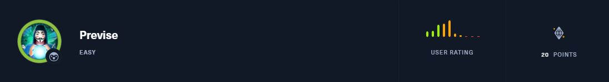

# CTF Write-ups

 
<i>Writeups Challenges I have solved</i>

You can see all the writeups here : <a href="https://hsnhk.gitbook.io/ctf-writeups/">gitbook</a>

* [CTF-writeups](https://github.com/HSNHK/CTF-writeups)
    * [Hack The Box](#hack-the-box)
    * [CTF learn](#ctf-learn)
    * [Try Hack Me](#tryhackme)

# Hack The Box
| Name  | Type | Descriptions | Writeup | 
| ----- | ---- | ------------ | ------- |
| Previse | Machine |  | [Writeup](HackTheBox/machines/Previse) |
| Toxic | Web | Humanity has exploited our allies, the dart frogs, for far too long, take back the freedom of our lovely poisonous friends. Malicious input is out of the question when dart frogs meet industrialisation. 🐸 | [Writeup](HackTheBox/challenges/web/Toxic) | 
| Emdee five for life | Web | Can you encrypt fast enough? | [Writeup](HackTheBox/challenges/web/Emdee-five-for-life) |
| FreeLancer | Web | Can you test how secure my website is? Prove me wrong and capture the flag! | [Writeup](HackTheBox/challenges/web/FreeLancer) |
| Templated | Web | Can you exploit this simple mistake? | [Writeup](HackTheBox/challenges/web/Templated) |
| Impossible Password | Reversing | Are you able to cheat me and get the flag? | [Writeup](HackTheBox/challenges/reversing/Impossible-Password) |
| Illumination | Forensics | A Junior Developer just switched to a new source control platform. Can you find the secret token? | [Writeup](HackTheBox/challenges/forensics/Illumination) |
| Phonebook | Web | Who is lucky enough to be included in the phonebook? | [Writeup](HackTheBox/challenges/web/Phonebook) |
| baby ninja jinja | Web | The elders of the village summoned you to take the reigns after the recent death of you father. It's time to end the emperor's gruesome tyranny. | [Writeup](HackTheBox/challenges/web/baby-ninja-jinja) |
| Gunship | Web | A city of lights, with retrofuturistic 80s peoples, and coffee, and drinks from another world... all the wooing in the world to make you feel more lonely... this ride ends here, with a tribute page of the British synthwave band called Gunship. 🎶 | [Writeup](HackTheBox/challenges/web/Gunship) |

# CTF learn
| Name  | Type | Descriptions | Writeup | 
| ----- | ---- | ------------ | ------- |
| Inj3ction Time | Web | I stumbled upon this website: http://web.ctflearn.com/web8/ and I think they have the flag in their somewhere. UNION might be a helpful command | [Writeup](CTFlearn/web/Inj3ction-Time) |
| Calculat3 M3  | Web | Here! http://web.ctflearn.com/web7/ I forget how we were doing those calculations, but something tells me it was pretty insecure. | [Writeup](CTFlearn/web/Calculat3-M3) |

# Tryhackme
| Name  | Type | Descriptions | Writeup | 
| ----- | ---- | ------------ | ------- |
| Basic Malware RE | Room | This room aims towards helping everyone learn about the basics of “Malware Reverse Engineering”. | [Writeup](https://0xhassan.medium.com/tryhackme-basic-malware-re-bfcd518fd314) |
| Reversing ELF | Room | Room for beginner Reverse Engineering CTF players. | [Writeup](https://0xhassan.medium.com/tryhackme-reversing-elf-60ab96969e41) |
| Reverse Engineering | Room | This room focuses on teaching the basics of assembly through reverse engineering. | [Writeup](https://0xhassan.medium.com/tryhackme-reverse-engineering-9cd408849f13) |
| Blue | Machine | Deploy & hack into a Windows machine, leveraging common misconfigurations issues. | [Writeup](https://0xhassan.medium.com/tryhackme-blue-1ccfae7c2e8a) |
| OWASP Top 10 | Room | Learn about and exploit each of the OWASP Top 10 vulnerabilities; the 10 most critical web security risks. | [Writeup](https://0xhassan.medium.com/tryhackme-owasp-top-10-e2b342c4f9f8) |
| Nmap Room | Room |  An in depth look at scanning with Nmap, a powerful network scanning tool. | [Writeup](https://0xhassan.medium.com/tryhackme-nmap-room-9db134d5c8cc) |
| The find command | Room | A learn-by-doing approach to the find command. | [Writeup](https://0xhassan.medium.com/tryhackme-the-find-command-d64026d89c3) |
